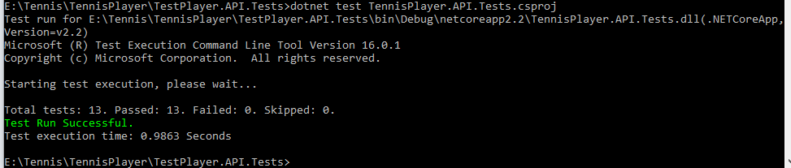
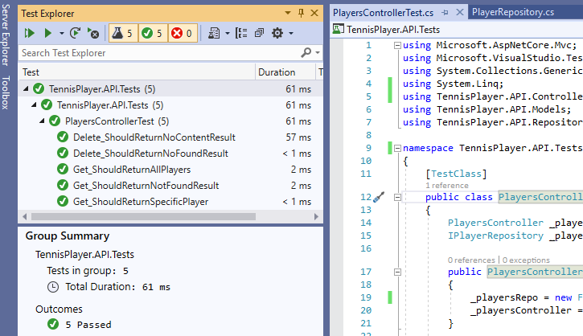
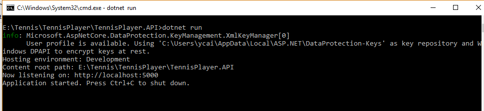
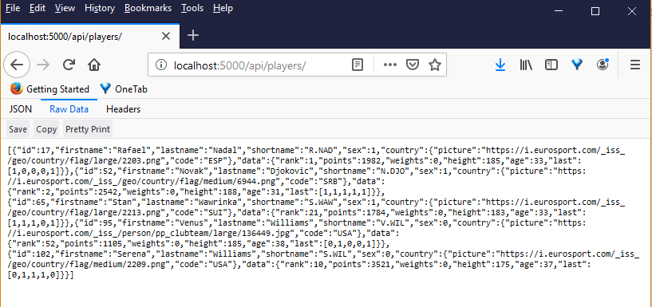
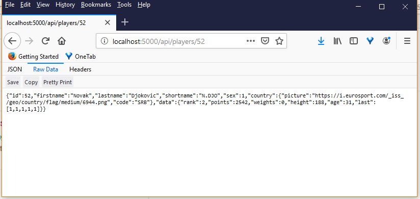
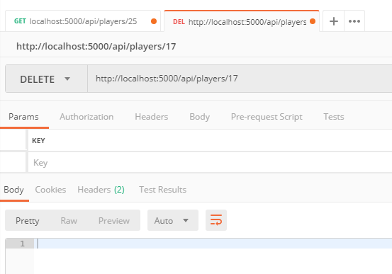
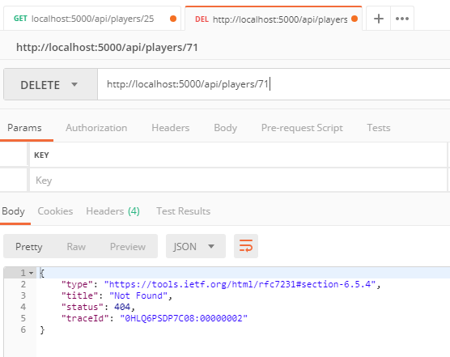

 ## Tennis player API

### Description
An Asp.Net Core Web API project containing following end points:

API| Description|Request Body|Response Body
----------------------------| -----|------|-------|
GET /api/players|Get all players ordered by Id|None|Array of players ordered by Id
GET /api/players/{id}|Get a player by Id|None|A player or 404 if Id doesn't exist |
DELETE /api/players/{id}|Delete a player by Id|None|204 or 404 if Id doesn't exist |

### How to run and test
**0. Install Visual Studio 2019 and .Net Core 2.2 SDK**

**1. Run the unit tests** </br>
Under the test project folder, type the command *dotnet test <test_project_name>* to run the unit tests


</br></br>
We can also use **Test Explorer** of Visual Studio to run the test: 
</br>


**2. Run the API project**</br>
Under the API project folder, type the command *dotnet run* to start the API locally


**3. Test the API locally**</br>
(1) To test the two GET end points, we can simply type the end point url in a brower:

**Get all players**</br>


**Get a player by Id**</br>


**Get a non existant player**</br>


(2) To test the DELETE end points, we can use **Postman**

**Delete a player by Id:**</br>

</br></br>
**Delete a non existant player**</br>


 ## API Documentation generation
1. An API documentation can be generated using the [Swashbuckle.AspNetCore](https://www.nuget.org/packages/Swashbuckle.AspNetCore.Swagger/) nuget package. To test it, type http://<hosturi>/swagger/ in a browser:
</br>


</br>

2. We can use the **[NSwag](https://github.com/RicoSuter/NSwag)** tool to write a **batch script** to generate the json file used by Swagger.

Here is an example:
 ```
SET FILE_NAME=TennisPlayerApi
SET SOURCE_DLL=bin\Debug\netcoreapp2.2\TennisPlayer.API.dll
SET TARGET_DIR=E:\Tennis\TennisPlayer\TennisPlayer.API\ApiDoc\
SET TITLE=swaggerTest
SET DESCRIPTION=SwaggerTest
SET VERSION=1.0.0
SET HOST=localhost:5000
dotnet E:\Tennis\NSwag\NetCore22\dotnet-nswag.dll webapi2swagger /assembly:"%SOURCE_DLL%" /AspNetCore:true /output:%TARGET_DIR%%FILE_NAME%.json /InfoTitle:"%TITLE%" /InfoDescription:"%DESCRIPTION%" /InfoVersion:%VERSION% /ServiceHost:%HOST%

 ```
The generated json file can then be used by [Swagger UI](https://github.com/swagger-api/swagger-ui) to make a documentation site.