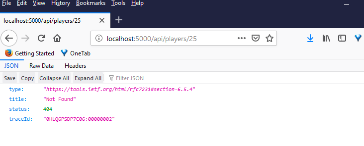
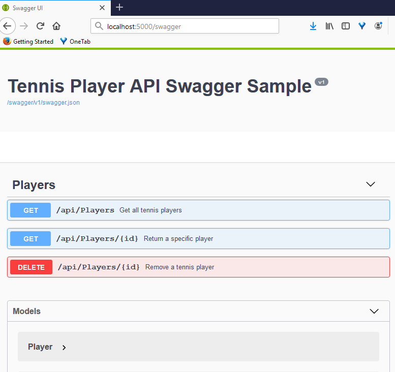

 ## Tennis player API

### Description
An Asp.Net Core Web API project containing following end points:

API| Description|Request Body|Response Body
----------------------------| -----|------|-------|
GET /api/players|Get all players ordered by Id|None|Array of players
GET /api/players/{id}|Get a player by Id|None|A player or 404 if Id doesn't exists |
DELETE /api/players/{id}|Delete a player by Id|None|204 or 404 if Id doesn't exists |

### How to run and test
**0. Install Visual Studio 2019 and .Net Core 2.2 SDK**

**1. Run the unit tests**  
Under the test project folder, type the command *dotnet test <test_project_name>* to run the unit tests

  
We can also use **Test Explorer** of Visual Studio to run the test: 
 

**2. Run the API project** 
Under the API project folder, type the command *dotnet run* to start the API locally

**3. Test the API locally** 
(1) To test the two GET end points, we can simply type the end point url in a brower:

**Get all players** 

**Get a player by Id** 

**Get a non existant player** 

(2) To test the DELETE end points, we can use **Postman**

**Delete a player by Id:** 

  
**Delete a non existant player** 

 ## API Documentation
An API documentation is generated using the [Swashbuckle.AspNetCore](https://www.nuget.org/packages/Swashbuckle.AspNetCore.Swagger/) nuget package. To test it, type http://<hosturi>/swagger/ in a browser:
 

